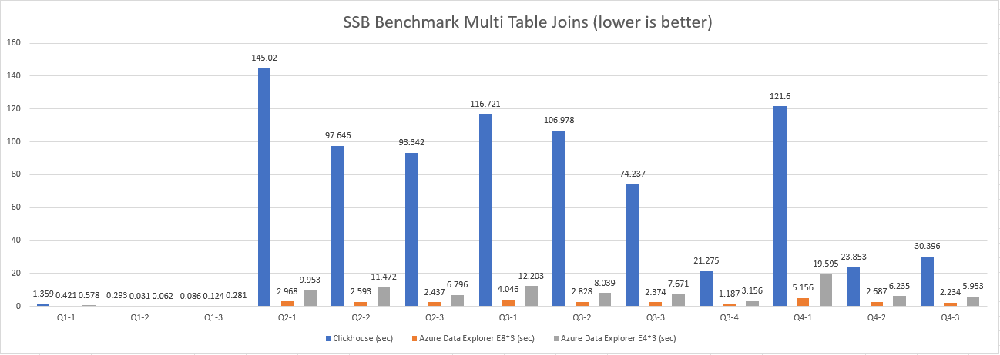

# Azure Data Explorer Star Schema Benchmark versus Clickhouse

In this article I will start a Start Schema Benchmark, also known as SSB, on Azure Data Explorer and Clickhouse respectively
to measure and compare the performance.

## What is Star Schema Benchmark(SSB)
Star Schema Benchmark, aks SSB, is designed to measure performance of database products in support of data warehousing
application. It is developed based on [TPC-H benchmark](https://www.tpc.org/tpch/) but with a curated schema version.
Simply speaking, SSB benchmarking schema is easier for developer to verify the performance of major commercial
databases with a concise schema and queries.

**TPC-H Schema**


**SSB Schema**


If you are interested in the details of Star Schema Benchmark, please visit the [Paper](https://www.cs.umb.edu/~poneil/StarSchemaB.pdf)
for more details.

## Why Azure Data Explorer
Azure Data Explorer is a fast, fully managed data analytics service for real-time analysis on large volumes of data streaming
from applications, websites, IoT devices, and more. In modern analytical scenarios, we need to have a fast and accurate insight
from terabytes of data, in addition, from data lakehouse perspective, storage and compute should be decoupled and scaled
respectively to achieve cost-effectiveness. Azure Data Explorer acts an important role in Azure Analytics Stack to support
users to achieve cost-effective queries and storage by leveraging fully managed PaaS data service, without maintenance overhead.

## Preparation

### Environment
**ADX Cluster:**
- 3 nodes; Standard_E8d_v5, 8 cores, 64 GB memory for each node
- 3 nodes; Standard_E4d_v5, 4 cores, 32 GB memory for each node

**Clickhouse Cluster:**
- 3 nodes; Standard E8ds v5, 8 cores, 64 GB memory for each node

### Generate Data
1. Compile SSB-Benchmark

   ```shell
   git clone https://github.com/vadimtk/ssb-dbgen.git
   cd ssb-dbgen
   make clean
   make
   ```

2. Generate SSB data files

   ```shell
   ./dbgen -s 100 -T a
   ```

3. Create table schema in Clickhouse

    ```shell
    CREATE DATABASE ssb;
   
    CREATE TABLE ssb.customer on Cluster benchmark
    (
    C_CUSTKEY       UInt32,
    C_NAME          String,
    C_ADDRESS       String,
    C_CITY          LowCardinality(String),
    C_NATION        LowCardinality(String),
    C_REGION        LowCardinality(String),
    C_PHONE         String,
    C_MKTSEGMENT    LowCardinality(String)
    )
    ENGINE = MergeTree ORDER BY (C_CUSTKEY);
    
    ## Create Distributed Table in Clickhouse cluster
    CREATE TABLE ssb.dist_customer ON CLUSTER benchmark as ssb.customer engine = Distributed(benchmark, ssb, customer, rand());
    
    CREATE TABLE ssb.lineorder on Cluster benchmark
    (
    LO_ORDERKEY             UInt32,
    LO_LINENUMBER           UInt8,
    LO_CUSTKEY              UInt32,
    LO_PARTKEY              UInt32,
    LO_SUPPKEY              UInt32,
    LO_ORDERDATE            Date,
    LO_ORDERPRIORITY        LowCardinality(String),
    LO_SHIPPRIORITY         UInt8,
    LO_QUANTITY             UInt8,
    LO_EXTENDEDPRICE        UInt32,
    LO_ORDTOTALPRICE        UInt32,
    LO_DISCOUNT             UInt8,
    LO_REVENUE              UInt32,
    LO_SUPPLYCOST           UInt32,
    LO_TAX                  UInt8,
    LO_COMMITDATE           Date,
    LO_SHIPMODE             LowCardinality(String)
    )
    ENGINE = MergeTree PARTITION BY toYear(LO_ORDERDATE) ORDER BY (LO_ORDERDATE, LO_ORDERKEY);
    
    CREATE TABLE ssb.dist_lineorder ON CLUSTER benchmark as ssb.lineorder engine = Distributed(benchmark, ssb, lineorder, rand());
    
    CREATE TABLE ssb.part on Cluster benchmark
    (
    P_PARTKEY       UInt32,
    P_NAME          String,
    P_MFGR          LowCardinality(String),
    P_CATEGORY      LowCardinality(String),
    P_BRAND         LowCardinality(String),
    P_COLOR         LowCardinality(String),
    P_TYPE          LowCardinality(String),
    P_SIZE          UInt8,
    P_CONTAINER     LowCardinality(String)
    )
    ENGINE = MergeTree ORDER BY P_PARTKEY;
    
    CREATE TABLE ssb.dist_part ON CLUSTER benchmark as ssb.part engine = Distributed(benchmark, ssb, part, rand());
    
    CREATE TABLE ssb.supplier on Cluster benchmark
    (
    S_SUPPKEY       UInt32,
    S_NAME          String,
    S_ADDRESS       String,
    S_CITY          LowCardinality(String),
    S_NATION        LowCardinality(String),
    S_REGION        LowCardinality(String),
    S_PHONE         String
    )
    ENGINE = MergeTree ORDER BY S_SUPPKEY;
    
    CREATE TABLE ssb.dist_supplier ON CLUSTER benchmark as ssb.supplier engine = Distributed(benchmark, ssb, supplier, rand());
    
    
    CREATE TABLE dates
    (
    D_DATEKEY          Date,
    D_DATE             String,
    D_DAYOFWEEK        String,
    D_MONTH            String,
    D_YEAR             UInt8,
    D_YEARMONTHNUM     UInt8,
    D_YEARMONTH        String,
    D_DAYNUMINWEEK     UInt8,
    D_DAYNUMINMONTH    UInt8,
    D_DAYNUMINYEAR     UInt8,
    D_MONTHNUMINYEAR   UInt8,
    D_WEEKNUMINYEAR    UInt8,
    D_SELLINGSEASON    String,
    D_LASTDAYINWEEKFL  UInt8,
    D_LASTDAYINMONTHFL UInt8,
    D_HOLIDAYFL        UInt8,
    D_WEEKDAYFL        UInt8
    )
    ENGINE = MergeTree ORDER BY (D_DATEKEY);
    
    CREATE TABLE ssb.dist_dates ON CLUSTER benchmark as ssb.dates engine = Distributed(benchmark, ssb, dates, rand());
    ```
4. Load data into Clickhouse

   ```shell
    clickhouse-client --query "INSERT INTO ssb.customer FORMAT CSV" < customer.tbl
    clickhouse-client --query "INSERT INTO ssb.part FORMAT CSV" < part.tbl
    clickhouse-client --query "INSERT INTO ssb.supplier FORMAT CSV" < supplier.tbl
    clickhouse-client --query "INSERT INTO ssb.lineorder FORMAT CSV" < lineorder.tbl
    clickhouse-client --query "INSERT INTO ssb.dates FORMAT CSV" < dates.tbl
   ```
5. Create a flat lineorder fact table for benchmark

    ```shell
    SET max_memory_usage = 17179869184;
       
    CREATE TABLE ssb.lineorder_flat on Cluster benchmark
    ENGINE = MergeTree
    PARTITION BY toYear(LO_ORDERDATE)
    ORDER BY (LO_ORDERDATE, LO_ORDERKEY) AS
    SELECT
    l.LO_ORDERKEY AS LO_ORDERKEY,
    l.LO_LINENUMBER AS LO_LINENUMBER,
    l.LO_CUSTKEY AS LO_CUSTKEY,
    l.LO_PARTKEY AS LO_PARTKEY,
    l.LO_SUPPKEY AS LO_SUPPKEY,
    l.LO_ORDERDATE AS LO_ORDERDATE,
    l.LO_ORDERPRIORITY AS LO_ORDERPRIORITY,
    l.LO_SHIPPRIORITY AS LO_SHIPPRIORITY,
    l.LO_QUANTITY AS LO_QUANTITY,
    l.LO_EXTENDEDPRICE AS LO_EXTENDEDPRICE,
    l.LO_ORDTOTALPRICE AS LO_ORDTOTALPRICE,
    l.LO_DISCOUNT AS LO_DISCOUNT,
    l.LO_REVENUE AS LO_REVENUE,
    l.LO_SUPPLYCOST AS LO_SUPPLYCOST,
    l.LO_TAX AS LO_TAX,
    l.LO_COMMITDATE AS LO_COMMITDATE,
    l.LO_SHIPMODE AS LO_SHIPMODE,
    c.C_NAME AS C_NAME,
    c.C_ADDRESS AS C_ADDRESS,
    c.C_CITY AS C_CITY,
    c.C_NATION AS C_NATION,
    c.C_REGION AS C_REGION,
    c.C_PHONE AS C_PHONE,
    c.C_MKTSEGMENT AS C_MKTSEGMENT,
    s.S_NAME AS S_NAME,
    s.S_ADDRESS AS S_ADDRESS,
    s.S_CITY AS S_CITY,
    s.S_NATION AS S_NATION,
    s.S_REGION AS S_REGION,
    s.S_PHONE AS S_PHONE,
    p.P_NAME AS P_NAME,
    p.P_MFGR AS P_MFGR,
    p.P_CATEGORY AS P_CATEGORY,
    p.P_BRAND AS P_BRAND,
    p.P_COLOR AS P_COLOR,
    p.P_TYPE AS P_TYPE,
    p.P_SIZE AS P_SIZE,
    p.P_CONTAINER AS P_CONTAINER
    FROM ssb.lineorder AS l
    INNER JOIN ssb.customer AS c ON c.C_CUSTKEY = l.LO_CUSTKEY
    INNER JOIN ssb.supplier AS s ON s.S_SUPPKEY = l.LO_SUPPKEY
    INNER JOIN ssb.part AS p ON p.P_PARTKEY = l.LO_PARTKEY
    ;
    
    CREATE TABLE ssb.dist_lineorder_flat ON CLUSTER benchmark as ssb.lineorder_flat engine = Distributed(benchmark, ssb, lineorder_flat, rand());
    ```

6. Unload data into csv files

   ```shell
   clickhouse-client --query "SELECT * from ssb.lineorder_flat" --format CSV > lineorder_flat.csv
   clickhouse-client --query "SELECT * from ssb.lineorder" --format CSV > lineorder.csv
   clickhouse-client --query "SELECT * from ssb.customer" --format CSV > customer.csv
   clickhouse-client --query "SELECT * from ssb.part" --format CSV > part.csv
   clickhouse-client --query "SELECT * from ssb.supplier" --format CSV > supplier.csv
   clickhouse-client --query "SELECT * from ssb.dates" --format CSV > dates.csv                         
   ```

   Truncate table data for data backfill into shards in Clickhouse cluster
    ```
   truncate table lineorder_flat;
   truncate table lineorder;
   truncate table customer;
   truncate table part;
   truncate table supplier;
   truncate table dates;
   ```

7. Load data back to Distributed table in multiple shards in Clickhouse cluster

   ```shell
    clickhouse-client --query "INSERT INTO ssb.dist_customer FORMAT CSV" < customer.csv
    clickhouse-client --query "INSERT INTO ssb.dist_part FORMAT CSV" < part.csv
    clickhouse-client --query "INSERT INTO ssb.dist_supplier FORMAT CSV" < supplier.csv
    clickhouse-client --query "INSERT INTO ssb.dist_lineorder FORMAT CSV" < lineorder.csv
    clickhouse-client --query "INSERT INTO ssb.dist_lineorder_flat FORMAT CSV" < lineorder_flat.csv
    clickhouse-client --query "INSERT INTO ssb.dist_dates FORMAT CSV" < dates.csv
   ```

8. Split the fact tables (lineorder/lineorder_flat) data file into multiple segments less than 4GB, which is the limit file size for Azure Data Explorer Lightingest

   For scale factor 100, the total line number of lineorder is 600,038,145, we will evenly distribute into multiple files.

    ``` shell
    split -d -l 35000000 lineorder.csv lineorder_part_
    split -d -l 10020000 /data3/clickouse/data/lineorder_flat.csv lineorder_flat_part_
    ```

9. Upload segment files to ADLS Gen2 for ADX data ingestion

   ```shell
   az storage fs directory upload -f ssb --account-name <storage account> -s lineorder/* -d 100G/lineorder/csv/ --recursive
   az storage fs directory upload -f ssb --account-name <storage account> -s lineorder_flat/* -d 100G/lineorder_flat/csv/ --recursive
   ```

## 3. Use Light Ingest to ingest segment data into Azure Data Explorer

Please refer to below official document to create ADX cluster and database for preparation
https://docs.microsoft.com/en-us/azure/data-explorer/create-cluster-database-portal

Please refer to below official document to ingest data into ADX cluster
1. [Install Light Ingest](https://docs.microsoft.com/en-us/azure/data-explorer/lightingest)
2. [Use wizard for one-time ingestion of historical data with LightIngest](https://docs.microsoft.com/en-us/azure/data-explorer/generate-lightingest-command)


## 4. Create table schema and partitioning/roworder policy
Table `customer`
```sql
.create table customer (C_CUSTKEY: long, C_NAME: string, C_ADDRESS: string, C_CITY: string, C_NATION: string, C_REGION: string, C_PHONE: string, C_MKTSEGMENT: string)
```
Table `dates`
```sql
.create table dates (D_DATEKEY: datetime, D_DATE: string, D_DAYOFWEEK: string, D_MONTH: string, D_YEAR: int, D_YEARMONTHNUM: long, D_YEARMONTH: string, D_DAYNUMINWEEK: int, D_DAYNUMINMONTH: int, D_DAYNUMINYEAR: int, D_MONTHNUMINYEAR: int, D_WEEKNUMINYEAR: int, D_SELLINGSEASON: string, D_LASTDAYINWEEKFL: int, D_LASTDAYINMONTHFL: int, D_HOLIDAYFL: int, D_WEEKDAYFL: int)
```
Table `part`
```sql
.create table dates (D_DATEKEY: datetime, D_DATE: string, D_DAYOFWEEK: string, D_MONTH: string, D_YEAR: int, D_YEARMONTHNUM: long, D_YEARMONTH: string, D_DAYNUMINWEEK: int, D_DAYNUMINMONTH: int, D_DAYNUMINYEAR: int, D_MONTHNUMINYEAR: int, D_WEEKNUMINYEAR: int, D_SELLINGSEASON: string, D_LASTDAYINWEEKFL: int, D_LASTDAYINMONTHFL: int, D_HOLIDAYFL: int, D_WEEKDAYFL: int)
```
Table `supplier`
```sql
.create table supplier (S_SUPPKEY: long, S_NAME: string, S_ADDRESS: string, S_CITY: string, S_NATION: string, S_REGION: string, S_PHONE: string) 
```
Table `lineorder_daily_partition`
```sql
.create table lineorder_daily_partition (LO_ORDERKEY: long, LO_LINENUMBER: int, LO_CUSTKEY: long, LO_PARTKEY: long, LO_SUPPKEY: long, LO_ORDERDATE: datetime, LO_ORDERPRIORITY: string, LO_SHIPPRIORITY: int, LO_QUANTITY: int, LO_EXTENDEDPRICE: long, LO_ORDTOTALPRICE: long, LO_DISCOUNT: int, LO_REVENUE: long, LO_SUPPLYCOST: long, LO_TAX: int, LO_COMMITDATE: datetime, LO_SHIPMODE: string) with (docstring = "Created based on lineorder")
```
Table `lineorder_flat`
```sql
.create table lineorder_flat (LO_ORDERKEY: long, LO_LINENUMBER: int, LO_CUSTKEY: long, LO_PARTKEY: long, LO_SUPPKEY: long, LO_ORDERDATE: datetime, LO_ORDERPRIORITY: string, LO_SHIPPRIORITY: int, LO_QUANTITY: int, LO_EXTENDEDPRICE: long, LO_ORDTOTALPRICE: long, LO_DISCOUNT: int, LO_REVENUE: long, LO_SUPPLYCOST: long, LO_TAX: int, LO_COMMITDATE: datetime, LO_SHIPMODE: string, C_NAME: string, C_ADDRESS: string, C_CITY: string, C_NATION: string, C_REGION: string, C_PHONE: string, C_MKTSEGMENT: string, S_NAME: string, S_ADDRESS: string, S_CITY: string, S_NATION: string, S_REGION: string, S_PHONE: string, P_NAME: string, P_MFGR: string, P_CATEGORY: string, P_BRAND: string, P_COLOR: string, P_TYPE: string, P_SIZE: int, P_CONTAINER: string) 
```

Partitioning Policy
```sql
.alter table lineorder_flat policy partitioning ```
{
  "PartitionKeys": [
    {
      "ColumnName": "LO_ORDERDATE",
      "Kind": "UniformRange",
      "Properties": {
        "Reference": "1992-01-01T00:00:00",
        "RangeSize": "30.00:00:00",
        "OverrideCreationTime": false
      }
    }
  ]
}```

.alter table lineorder_daily_partition policy partitioning ```
{
  "PartitionKeys": [
    {
      "ColumnName": "LO_ORDERDATE",
      "Kind": "UniformRange",
      "Properties": {
        "Reference": "1992-01-01T00:00:00",
        "RangeSize": "1.00:00:00",
        "OverrideCreationTime": false
      }
    }
  ]
}```
```

Roworder Policy
```sql
.alter table lineorder_flat policy roworder (LO_ORDERDATE asc, LO_ORDERKEY asc);

.alter table lineorder_daily_partition policy roworder (LO_ORDERDATE asc, LO_ORDERKEY asc);
```

## Run Queries

### Clickhouse
Before running SSB queries in Clickhouse, it will be better to reset the cache to reduce the performance impact by system cache

Reset the OS [PageCache](https://www.tecmint.com/clear-ram-memory-cache-buffer-and-swap-space-on-linux/)

```
sync; echo 1 > /proc/sys/vm/drop_caches
```

Reset mark-cache in Clickhouse using [DROP MARK CACHE](https://clickhouse.tech/docs/en/sql_reference/statements/system/#query_language-system-drop-mark-cache)
```
SYSTEM DROP MARK CACHE
```

If you encounters the error below
> Double-distributed IN/JOIN subqueries is denied (distributed_product_mode = 'deny'). You may rewrite query to use local tables in subqueries, or use GLOBAL keyword, or set distributed_product_mode to suitable value.

Set `distributed product mode` to `global` to enable multi-join benchmark in Clickhouse
```
SET distributed_product_mode = 'global';
```

##### Q1.1

Flat table
```sql
SELECT sum(LO_EXTENDEDPRICE * LO_DISCOUNT) AS revenue
FROM dist_lineorder_flat
WHERE toYear(LO_ORDERDATE) = 1993
  AND LO_DISCOUNT BETWEEN 1 AND 3
  AND LO_QUANTITY < 25;
```

Multi table join

```sql
SELECT sum(LO_EXTENDEDPRICE*LO_DISCOUNT) AS revenue
FROM dist_lineorder
LEFT JOIN dist_dates ON LO_ORDERDATE = D_DATEKEY
WHERE toYear(LO_ORDERDATE) = 1993
  AND LO_DISCOUNT BETWEEN 1 AND 3
  AND LO_QUANTITY < 25;
```

##### Q1.2

Flat table
```sql
SELECT SUM(LO_EXTENDEDPRICE * LO_DISCOUNT) AS revenue
FROM dist_lineorder_flat
WHERE toYYYYMM(LO_ORDERDATE) = 199401 AND LO_DISCOUNT BETWEEN 4 AND 6 AND LO_QUANTITY BETWEEN 26 AND 35;
```

Multi table join

```sql
SELECT SUM(LO_EXTENDEDPRICE*LO_DISCOUNT) AS revenue
FROM dist_lineorder
LEFT JOIN dist_dates ON LO_ORDERDATE = D_DATEKEY
WHERE toYYYYMM(LO_ORDERDATE) = 199401
  AND LO_DISCOUNT between 4 AND 6
  AND LO_QUANTITY between 26 AND 35;
```

##### Q1.3

Flat table
```sql
SELECT SUM(LO_EXTENDEDPRICE * LO_DISCOUNT) AS revenue
FROM dist_lineorder_flat
WHERE toISOWeek(LO_ORDERDATE) = 6 AND toYear(LO_ORDERDATE) = 1994
  AND LO_DISCOUNT BETWEEN 5 AND 7 AND LO_QUANTITY BETWEEN 26 AND 35;
```

Multi table join

```sql
SELECT SUM(LO_EXTENDEDPRICE*LO_DISCOUNT) AS revenue
FROM dist_lineorder
LEFT JOIN dist_dates ON LO_ORDERDATE = D_DATEKEY
WHERE toISOWeek(LO_ORDERDATE) = 6 AND toYear(LO_ORDERDATE) = 1994
  AND LO_DISCOUNT BETWEEN 5 AND 7 AND LO_QUANTITY BETWEEN 26 AND 35;
```

##### Q2.1

Flat table
```sql
SELECT
    SUM(LO_REVENUE),
    toYear(LO_ORDERDATE) AS year,
    P_BRAND
FROM dist_lineorder_flat
WHERE P_CATEGORY = 'MFGR#12' AND S_REGION = 'AMERICA'
GROUP BY
    year,
    P_BRAND
ORDER BY
    year,
    P_BRAND;
```

Multi table join

```sql
SELECT SUM(LO_REVENUE) AS lo_revenue, D_YEAR, P_BRAND
FROM dist_lineorder
LEFT JOIN dist_dates ON LO_ORDERDATE= D_DATEKEY
LEFT JOIN dist_part ON LO_PARTKEY = P_PARTKEY
LEFT JOIN dist_supplier ON LO_SUPPKEY = S_SUPPKEY
WHERE P_CATEGORY = 'MFGR#12' AND S_REGION = 'AMERICA'
GROUP BY D_YEAR, P_BRAND
ORDER BY D_YEAR, P_BRAND;
```

##### Q2.2

Flat table
```sql
SELECT
    SUM(LO_REVENUE),
    toYear(LO_ORDERDATE) AS year,
    P_BRAND
FROM dist_lineorder_flat
WHERE P_BRAND >= 'MFGR#2221' AND P_BRAND <= 'MFGR#2228' AND S_REGION = 'ASIA'
GROUP BY
    year,
    P_BRAND
ORDER BY
    year,
    P_BRAND;
```

Multi table join

```sql
SELECT SUM(LO_REVENUE) AS lo_revenue, D_YEAR, P_BRAND
FROM dist_lineorder
LEFT JOIN dist_dates ON LO_ORDERDATE= D_DATEKEY
LEFT JOIN dist_part ON LO_PARTKEY = P_PARTKEY
LEFT JOIN dist_supplier ON LO_SUPPKEY = S_SUPPKEY
WHERE P_BRAND >= 'MFGR#2221' AND P_BRAND <= 'MFGR#2228' AND S_REGION = 'ASIA'
GROUP BY D_YEAR, P_BRAND
ORDER BY D_YEAR, P_BRAND;
```

##### Q2.3

Flat table
```sql
SELECT
    SUM(LO_REVENUE),
    toYear(LO_ORDERDATE) AS year,
    P_BRAND
FROM dist_lineorder_flat
WHERE P_BRAND = 'MFGR#2239' AND S_REGION = 'EUROPE'
GROUP BY
    year,
    P_BRAND
ORDER BY
    year,
    P_BRAND;
```

Multi table join

```sql
SELECT SUM(LO_REVENUE) AS lo_revenue, D_YEAR, P_BRAND
FROM dist_lineorder
LEFT JOIN dist_dates ON LO_ORDERDATE= D_DATEKEY
LEFT JOIN dist_part ON LO_PARTKEY = P_PARTKEY
LEFT JOIN dist_supplier ON LO_SUPPKEY = S_SUPPKEY
WHERE P_BRAND = 'MFGR#2239' AND S_REGION = 'EUROPE'
GROUP BY D_YEAR, P_BRAND
ORDER BY D_YEAR, P_BRAND;
```

##### Q3.1

Flat table
```sql
SELECT
    C_NATION,
    S_NATION,
    toYear(LO_ORDERDATE) AS year,
    SUM(LO_REVENUE) AS revenue
FROM dist_lineorder_flat
WHERE C_REGION = 'ASIA' AND S_REGION = 'ASIA' AND year >= 1992 AND year <= 1997
GROUP BY
    C_NATION,
    S_NATION,
    year
ORDER BY
    year ASC,
    revenue DESC;
```

Multi table join

```sql
SELECT SUM(LO_REVENUE) AS lo_revenue, toYear(LO_ORDERDATE) AS year, C_NATION, S_NATION
FROM dist_lineorder
LEFT JOIN dist_dates ON LO_ORDERDATE= D_DATEKEY
LEFT JOIN dist_customer ON LO_PARTKEY = C_CUSTKEY
LEFT JOIN dist_supplier ON LO_SUPPKEY = S_SUPPKEY
WHERE C_REGION = 'ASIA' AND S_REGION = 'ASIA' AND year >= 1992 AND year <= 1997
GROUP BY C_NATION, S_NATION, year
ORDER BY year ASc, lo_revenue DESC;
```

##### Q3.2

Flat table
```sql
SELECT
    C_CITY,
    S_CITY,
    toYear(LO_ORDERDATE) AS year,
    SUM(LO_REVENUE) AS revenue
FROM dist_lineorder_flat
WHERE C_NATION = 'UNITED STATES' AND S_NATION = 'UNITED STATES' AND year >= 1992 AND year <= 1997
GROUP BY
    C_CITY,
    S_CITY,
    year
ORDER BY
    year ASC,
    revenue DESC;
```

Multi table join

```sql
SELECT SUM(LO_REVENUE) AS lo_revenue, toYear(LO_ORDERDATE) AS year, C_CITY, S_CITY
FROM dist_lineorder
LEFT JOIN dist_dates ON LO_ORDERDATE= D_DATEKEY
LEFT JOIN dist_customer ON LO_PARTKEY = C_CUSTKEY
LEFT JOIN dist_supplier ON LO_SUPPKEY = S_SUPPKEY
WHERE C_NATION = 'UNITED STATES' AND S_NATION = 'UNITED STATES' AND year >= 1992 AND year <= 1997
GROUP BY C_CITY, S_CITY, year
ORDER BY year ASc, lo_revenue DESC;
```

##### Q3.3

Flat table
```sql
SELECT
    C_CITY,
    S_CITY,
    toYear(LO_ORDERDATE) AS year,
    SUM(LO_REVENUE) AS revenue
FROM dist_lineorder_flat
WHERE (C_CITY = 'UNITED KI1' OR C_CITY = 'UNITED KI5') AND (S_CITY = 'UNITED KI1' OR S_CITY = 'UNITED KI5') AND year >= 1992 AND year <= 1997
GROUP BY
    C_CITY,
    S_CITY,
    year
ORDER BY
    year ASC,
    revenue DESC;

```

Multi table join

```sql
SELECT SUM(LO_REVENUE) AS lo_revenue, toYear(LO_ORDERDATE) AS year, C_CITY, S_CITY
FROM dist_lineorder
LEFT JOIN dist_dates ON LO_ORDERDATE= D_DATEKEY
LEFT JOIN dist_customer ON LO_PARTKEY = C_CUSTKEY
LEFT JOIN dist_supplier ON LO_SUPPKEY = S_SUPPKEY
WHERE (C_CITY ='UNITED KI1' or C_CITY ='UNITED KI5')
  AND (S_CITY='UNITED KI1' or S_CITY='UNITED KI5')
  AND year >= 1992 AND year <= 1997
GROUP BY C_CITY, S_CITY, year
ORDER BY year ASc, lo_revenue DESC;
```

##### Q3.4

Flat table
```sql
SELECT
    C_CITY,
    S_CITY,
    toYear(LO_ORDERDATE) AS year,
    SUM(LO_REVENUE) AS revenue
FROM dist_lineorder_flat
WHERE (C_CITY = 'UNITED KI1' OR C_CITY = 'UNITED KI5') AND (S_CITY = 'UNITED KI1' OR S_CITY = 'UNITED KI5') AND toYYYYMM(LO_ORDERDATE) = 199712
GROUP BY
    C_CITY,
    S_CITY,
    year
ORDER BY
    year ASC,
    revenue DESC;
```

Multi table join

```sql
SELECT SUM(LO_REVENUE) AS lo_revenue, toYear(LO_ORDERDATE) AS year, C_CITY, S_CITY
FROM dist_lineorder
LEFT JOIN dist_dates ON LO_ORDERDATE= D_DATEKEY
LEFT JOIN dist_customer ON LO_PARTKEY = C_CUSTKEY
LEFT JOIN dist_supplier ON LO_SUPPKEY = S_SUPPKEY
WHERE (C_CITY ='UNITED KI1' or C_CITY ='UNITED KI5')
  AND (S_CITY='UNITED KI1' or S_CITY='UNITED KI5')
  AND D_YEARMONTH == 'Dec1997'
GROUP BY C_CITY, S_CITY, year
ORDER BY year ASc, lo_revenue DESC;
```

##### Q4.1

Flat table
```sql
SELECT
    toYear(LO_ORDERDATE) AS year,
    C_NATION,
    SUM(LO_REVENUE - LO_SUPPLYCOST) AS profit
FROM lineorder_flat
WHERE C_REGION = 'AMERICA' AND S_REGION = 'AMERICA' AND (P_MFGR = 'MFGR#1' OR P_MFGR = 'MFGR#2')
GROUP BY
    year,
    C_NATION
ORDER BY
    year ASC,
    C_NATION ASC;
```

Multi table join

```sql
SELECT (SUM(LO_REVENUE ) - SUM(LO_SUPPLYCOST)) AS profit, toYear(LO_ORDERDATE) AS year, C_NATION
FROM dist_lineorder
LEFT JOIN dist_dates ON LO_ORDERDATE= D_DATEKEY
LEFT JOIN dist_customer ON LO_PARTKEY = C_CUSTKEY
LEFT JOIN dist_supplier ON LO_SUPPKEY = S_SUPPKEY
LEFT JOIN dist_part ON LO_PARTKEY = P_PARTKEY
WHERE C_REGION = 'AMERICA' AND S_REGION= 'AMERICA'
  AND (P_MFGR = 'MFGR#1' or P_MFGR = 'MFGR#2')
GROUP BY year, C_NATION
ORDER BY year ASc, C_NATION ASC;
```

##### Q4.2

Flat table
```sql
SELECT
    toYear(LO_ORDERDATE) AS year,
    S_NATION,
    P_CATEGORY,
    SUM(LO_REVENUE - LO_SUPPLYCOST) AS profit
FROM dist_lineorder_flat
WHERE C_REGION = 'AMERICA' AND S_REGION = 'AMERICA' AND (year = 1997 OR year = 1998) AND (P_MFGR = 'MFGR#1' OR P_MFGR = 'MFGR#2')
GROUP BY
    year,
    S_NATION,
    P_CATEGORY
ORDER BY
    year ASC,
    S_NATION ASC,
    P_CATEGORY ASC;
```

Multi table join

```sql
SELECT (SUM(LO_REVENUE ) - SUM(LO_SUPPLYCOST)) AS profit, toYear(LO_ORDERDATE) AS year, S_NATION, P_CATEGORY
FROM dist_lineorder
    LEFT JOIN dist_dates ON LO_ORDERDATE= D_DATEKEY
    LEFT JOIN dist_customer ON LO_PARTKEY = C_CUSTKEY
    LEFT JOIN dist_supplier ON LO_SUPPKEY = S_SUPPKEY
    LEFT JOIN dist_part ON LO_PARTKEY = P_PARTKEY
WHERE C_REGION = 'AMERICA' AND S_REGION = 'AMERICA' AND (year = 1997 OR year = 1998) AND (P_MFGR = 'MFGR#1' OR P_MFGR = 'MFGR#2')
GROUP BY
    year,
    S_NATION,
    P_CATEGORY
ORDER BY
    year ASC,
    S_NATION ASC,
    P_CATEGORY ASC;
```

##### Q4.3

Flat table
```sql
SELECT
    toYear(LO_ORDERDATE) AS year,
    S_CITY,
    P_BRAND,
    SUM(LO_REVENUE - LO_SUPPLYCOST) AS profit
FROM dist_lineorder_flat
WHERE S_NATION = 'UNITED STATES' AND (year = 1997 OR year = 1998) AND P_CATEGORY = 'MFGR#14'
GROUP BY
    year,
    S_CITY,
    P_BRAND
ORDER BY
    year ASC,
    S_CITY ASC,
    P_BRAND ASC;
```

Multi table join

```sql
SELECT
    toYear(LO_ORDERDATE) AS year,
    S_CITY,
    P_BRAND,
    (SUM(LO_REVENUE ) - SUM(LO_SUPPLYCOST)) AS profit
FROM dist_lineorder
    LEFT JOIN dist_dates ON LO_ORDERDATE= D_DATEKEY
    LEFT JOIN dist_customer ON LO_PARTKEY = C_CUSTKEY
    LEFT JOIN dist_supplier ON LO_SUPPKEY = S_SUPPKEY
    LEFT JOIN dist_part ON LO_PARTKEY = P_PARTKEY
WHERE S_NATION = 'UNITED STATES' AND (year = 1997 OR year = 1998) AND P_CATEGORY = 'MFGR#14'
GROUP BY
    year,
    S_CITY,
    P_BRAND
ORDER BY
    year ASC,
    S_CITY ASC,
    P_BRAND ASC;
```

### Azure Data Explorer
Here is a list of SSB queries rewritten in Kusto, which is used by Azure Data Explorer

##### Q1.1

Flat table
```sql
lineorder_flat
| where LO_ORDERDATE between(datetime(1993-01-01) .. datetime(1993-12-31))
    and LO_DISCOUNT  between (1 .. 3)
    and LO_QUANTITY < 25
| summarize revenue = sum(LO_EXTENDEDPRICE * LO_DISCOUNT)
```

Multi table join

```sql
lineorder_daily_partition
| lookup  kind=leftouter  ['dates'] on $left.LO_ORDERDATE == $right.D_DATEKEY
| where LO_ORDERDATE between(datetime(1993-01-01) .. datetime(1993-12-31))
    and LO_DISCOUNT between (1 ..3)
    and LO_QUANTITY < 25
| summarize revenue = sum(LO_EXTENDEDPRICE * LO_DISCOUNT)
```

##### Q1.2

Flat table
```sql
lineorder_flat
| where LO_ORDERDATE between(datetime(1994-01-01) .. datetime(1994-01-31))
    and LO_DISCOUNT between (4 .. 6)
    and LO_QUANTITY between (26 .. 35)
| summarize revenue = sum(LO_EXTENDEDPRICE * LO_DISCOUNT)
```

Multi table join

```sql
lineorder_daily_partition
| lookup  kind=leftouter  ['dates'] on $left.LO_ORDERDATE == $right.D_DATEKEY
| where LO_ORDERDATE between(datetime(1994-01-01) .. datetime(1994-01-31))
    and LO_DISCOUNT between (4 ..6)
    and LO_QUANTITY between (26 .. 35)
| summarize revenue = sum(LO_EXTENDEDPRICE * LO_DISCOUNT)
```
##### Q1.3

Flat table
```sql
lineorder_flat
| where LO_ORDERDATE between(datetime(1994-01-01) .. datetime(1994-12-31))
    and week_of_year(LO_ORDERDATE) == 6
    and LO_DISCOUNT between (5 .. 7)
    and LO_QUANTITY between (26 .. 35)
| summarize revenue = sum(LO_EXTENDEDPRICE * LO_DISCOUNT)
```

Multi table join

```sql
lineorder_daily_partition
| lookup  kind=leftouter ['dates'] on $left.LO_ORDERDATE == $right.D_DATEKEY
| where LO_ORDERDATE between(datetime(1994-01-01) .. datetime(1994-12-31))
    and D_WEEKNUMINYEAR == 6
    and LO_DISCOUNT between (5 ..7)
    and LO_QUANTITY between (26 .. 35)
| summarize revenue = sum(LO_EXTENDEDPRICE * LO_DISCOUNT)
```
##### Q2.1

Flat table
```sql
lineorder_flat
| extend order_year = getyear(LO_ORDERDATE)
| where P_CATEGORY == 'MFGR#12'
    and S_REGION == 'AMERICA'
| summarize revenue = sum(LO_REVENUE) by order_year, P_BRAND
| order by order_year, P_BRAND
| project revenue, order_year, P_BRAND

```

Multi table join

```sql
lineorder_daily_partition
| lookup  kind=inner  ['dates'] on $left.LO_ORDERDATE == $right.D_DATEKEY
| lookup  kind=inner  (['part'] | where P_CATEGORY == 'MFGR#12') on $left.LO_PARTKEY == $right.P_PARTKEY
| lookup  kind=inner  (['supplier'] | where S_REGION == 'AMERICA') on $left.LO_SUPPKEY == $right.S_SUPPKEY
| summarize revenue = sum(LO_REVENUE) by D_YEAR, P_BRAND
| order by D_YEAR, P_BRAND
| project revenue, D_YEAR, P_BRAND

```
##### Q2.2

Flat table
```sql
lineorder_flat
| extend order_year = getyear(LO_ORDERDATE)
| where P_BRAND matches regex "MFGR#222[1-8]"
    and S_REGION == 'ASIA'
| summarize revenue = sum(LO_REVENUE) by order_year, P_BRAND
| order by order_year, P_BRAND
| project revenue, order_year, P_BRAND
```

Multi table join

```sql
lineorder_daily_partition
| lookup  kind=inner  ['dates'] on $left.LO_ORDERDATE == $right.D_DATEKEY
| lookup  kind=inner  (['part'] | where P_BRAND matches regex "MFGR#222[1-8]") on $left.LO_PARTKEY == $right.P_PARTKEY
| lookup  kind=inner  (['supplier'] | where S_REGION == 'ASIA') on $left.LO_SUPPKEY == $right.S_SUPPKEY
| summarize revenue = sum(LO_REVENUE) by D_YEAR, P_BRAND
| order by D_YEAR, P_BRAND
| project revenue, D_YEAR, P_BRAND

```
##### Q2.3

Flat table
```sql
lineorder_flat
| extend order_year = getyear(LO_ORDERDATE)
| where P_BRAND == "MFGR#2239"
    and S_REGION == 'EUROPE'
| summarize revenue = sum(LO_REVENUE) by order_year, P_BRAND
| order by order_year, P_BRAND
| project revenue, order_year, P_BRAND
```

Multi table join

```sql
lineorder_daily_partition
| lookup  kind=inner  ['dates'] on $left.LO_ORDERDATE == $right.D_DATEKEY
| lookup  kind=inner  (['part'] | where P_BRAND == "MFGR#2239") on $left.LO_PARTKEY == $right.P_PARTKEY
| lookup  kind=inner  (['supplier'] | where S_REGION == 'EUROPE') on $left.LO_SUPPKEY == $right.S_SUPPKEY
| summarize revenue = sum(LO_REVENUE) by D_YEAR, P_BRAND
| order by D_YEAR, P_BRAND
| project revenue, D_YEAR, P_BRAND
```
##### Q3.1

Flat table
```sql
lineorder_flat
| extend order_year = getyear(LO_ORDERDATE)
| where C_REGION == 'ASIA'
    and S_REGION == 'ASIA'
    and order_year >= 1992
    and order_year <= 1997
| summarize revenue = sum(LO_REVENUE) by C_NATION, S_NATION, order_year
| order by order_year asc , revenue desc 
| project C_NATION, S_NATION, order_year, revenue
```

Multi table join

```sql
lineorder_daily_partition
| lookup  kind=inner   (['dates'] | where D_YEAR >= 1992 and D_YEAR <= 1997) on $left.LO_ORDERDATE == $right.D_DATEKEY
| lookup  kind=inner  (['customer'] | where C_REGION == "ASIA") on $left.LO_CUSTKEY == $right.C_CUSTKEY
| lookup  kind=inner  (['supplier'] | where S_REGION == 'ASIA') on $left.LO_SUPPKEY == $right.S_SUPPKEY
| summarize revenue = sum(LO_REVENUE) by C_NATION, S_NATION, D_YEAR
| order by D_YEAR asc , revenue desc
| project C_NATION, S_NATION, D_YEAR, revenue
```
##### Q3.2

Flat table
```sql
lineorder_flat
| extend order_year = getyear(LO_ORDERDATE)
| where C_NATION == 'UNITED STATES'
    and S_NATION == 'UNITED STATES'
    and order_year >= 1992
    and order_year <= 1997
| summarize revenue = sum(LO_REVENUE) by C_CITY, S_CITY, order_year
| order by order_year asc , revenue desc
| project C_CITY, S_CITY, order_year, revenue 
```

Multi table join

```sql
lineorder_daily_partition
| lookup  kind=inner   (['dates'] | where D_YEAR >= 1992 and D_YEAR <= 1997) on $left.LO_ORDERDATE == $right.D_DATEKEY
| lookup  kind=inner  (['customer'] | where C_NATION == "UNITED STATES") on $left.LO_CUSTKEY == $right.C_CUSTKEY
| lookup  kind=inner  (['supplier'] | where S_NATION == 'UNITED STATES') on $left.LO_SUPPKEY == $right.S_SUPPKEY
| summarize revenue = sum(LO_REVENUE) by C_CITY, S_CITY, D_YEAR
| order by D_YEAR asc , revenue desc
| project C_CITY, S_CITY, D_YEAR, revenue
```
##### Q3.3

Flat table
```sql
lineorder_flat
| extend order_year = getyear(LO_ORDERDATE)
| where (C_CITY == 'UNITED KI1'
    or C_CITY == 'UNITED KI5')
    and (S_CITY == 'UNITED KI1'
    or S_CITY == 'UNITED KI5')
    and order_year >= 1992
    and order_year <= 1997
| summarize revenue = sum(LO_REVENUE) by C_CITY, S_CITY, order_year
| order by order_year asc , revenue desc 
| project C_CITY, S_CITY, order_year, revenue
```

Multi table join

```sql
lineorder_daily_partition
| lookup  kind=inner   (['dates'] | where D_YEAR >= 1992 and D_YEAR <= 1997) on $left.LO_ORDERDATE == $right.D_DATEKEY
| lookup  kind=inner  (['customer'] | where (C_CITY == 'UNITED KI1' or C_CITY == 'UNITED KI5')) on $left.LO_CUSTKEY == $right.C_CUSTKEY
| lookup  kind=inner  (['supplier'] | where (S_CITY == 'UNITED KI1' or S_CITY == 'UNITED KI5')) on $left.LO_SUPPKEY == $right.S_SUPPKEY
| summarize revenue = sum(LO_REVENUE) by C_CITY, S_CITY, D_YEAR
| order by D_YEAR asc , revenue desc
| project C_CITY, S_CITY, D_YEAR, revenue

```
##### Q3.4

Flat table
```sql
lineorder_flat
| extend order_year = getyear(LO_ORDERDATE)
| where (C_CITY == 'UNITED KI1'
    or C_CITY == 'UNITED KI5')
    and (S_CITY == 'UNITED KI1'
    or S_CITY == 'UNITED KI5')
    and format_datetime(LO_ORDERDATE, 'yyyyMM') == 199712
| summarize revenue = sum(LO_REVENUE) by C_CITY, S_CITY, order_year
| order by order_year asc , revenue desc 
| project C_CITY, S_CITY, order_year, revenue

```

Multi table join

```sql
lineorder_daily_partition
| lookup  kind=inner   (['dates'] | where D_YEARMONTH == 'Dec1997') on $left.LO_ORDERDATE == $right.D_DATEKEY
| lookup  kind=inner  (['customer'] | where (C_CITY == 'UNITED KI1' or C_CITY == 'UNITED KI5')) on $left.LO_CUSTKEY == $right.C_CUSTKEY
| lookup  kind=inner  (['supplier'] | where (S_CITY == 'UNITED KI1' or S_CITY == 'UNITED KI5')) on $left.LO_SUPPKEY == $right.S_SUPPKEY
| summarize revenue = sum(LO_REVENUE) by C_CITY, S_CITY, D_YEAR
| order by D_YEAR asc , revenue desc
| project C_CITY, S_CITY, D_YEAR, revenue
```
##### Q4.1

Flat table
```sql
lineorder_flat
| extend order_year = getyear(LO_ORDERDATE)
| where C_REGION == 'AMERICA'
    and S_REGION == 'AMERICA'
    and (P_MFGR == 'MFGR#1' or P_MFGR == 'MFGR#2')
| summarize profit = sum(LO_REVENUE - LO_SUPPLYCOST) by order_year, C_NATION
| order by order_year asc, C_NATION asc
| project order_year, C_NATION, profit
```

Multi table join

```sql
lineorder_daily_partition
| lookup  kind=inner  ['dates'] on $left.LO_ORDERDATE == $right.D_DATEKEY
| lookup  kind=inner  (['customer'] | where C_REGION == 'AMERICA') on $left.LO_CUSTKEY == $right.C_CUSTKEY
| lookup  kind=inner  (['supplier'] | where S_REGION == 'AMERICA') on $left.LO_SUPPKEY == $right.S_SUPPKEY
| lookup  kind=inner  (['part'] | where P_MFGR == 'MFGR#1' or P_MFGR == 'MFGR#2') on $left.LO_PARTKEY == $right.P_PARTKEY
| summarize profit = (sum(LO_REVENUE) - sum(LO_SUPPLYCOST)) by D_YEAR, C_NATION
| order by D_YEAR, C_NATION
| project D_YEAR, C_NATION, profit
```
##### Q4.2

Flat table
```sql
lineorder_flat
| extend order_year = getyear(LO_ORDERDATE)
| where C_REGION == 'AMERICA'
    and S_REGION == 'AMERICA'
    and (order_year == 1997 or order_year == 1998)
    and (P_MFGR == 'MFGR#1' or P_MFGR == 'MFGR#2')
| summarize profit = sum(LO_REVENUE) - sum(LO_SUPPLYCOST) by order_year, S_NATION, P_CATEGORY
| order by order_year asc, S_NATION asc, P_CATEGORY asc
| project order_year, S_NATION, P_CATEGORY, profit
```

Multi table join

```sql
lineorder_daily_partition
| lookup  kind=inner  (['dates'] | where D_YEAR == 1997 or D_YEAR == 1998) on $left.LO_ORDERDATE == $right.D_DATEKEY
| lookup  kind=inner  (['customer'] | where C_REGION == 'AMERICA') on $left.LO_CUSTKEY == $right.C_CUSTKEY
| lookup  kind=inner  (['supplier'] | where S_REGION == 'AMERICA') on $left.LO_SUPPKEY == $right.S_SUPPKEY
| lookup  kind=inner  (['part'] | where P_MFGR == 'MFGR#1' or P_MFGR == 'MFGR#2') on $left.LO_PARTKEY == $right.P_PARTKEY
| summarize profit = (sum(LO_REVENUE) - sum(LO_SUPPLYCOST)) by D_YEAR, S_NATION, P_CATEGORY
| order by D_YEAR, S_NATION, P_CATEGORY
| project D_YEAR, S_NATION, P_CATEGORY, profit
```
##### Q4.3

Flat table
```sql
lineorder_flat
| extend order_year = getyear(LO_ORDERDATE)
| where S_NATION == 'UNITED STATES'
    and (order_year == 1997 or order_year == 1998)
    and P_CATEGORY == 'MFGR#14'
| summarize profit = sum(LO_REVENUE) - sum(LO_SUPPLYCOST) by order_year, S_CITY, P_BRAND
| order by order_year asc, S_CITY asc, P_BRAND asc
| project order_year, S_CITY, P_BRAND, profit
```

Multi table join

```sql
lineorder_daily_partition
| lookup  kind=inner  (['dates'] | where D_YEAR == 1997 or D_YEAR == 1998) on $left.LO_ORDERDATE == $right.D_DATEKEY
| lookup  kind=inner  (['customer'] | where C_REGION == 'AMERICA') on $left.LO_CUSTKEY == $right.C_CUSTKEY
| lookup  kind=inner  (['supplier'] | where S_NATION == 'UNITED STATES') on $left.LO_SUPPKEY == $right.S_SUPPKEY
| lookup  kind=inner  (['part'] | where P_CATEGORY == 'MFGR#14') on $left.LO_PARTKEY == $right.P_PARTKEY
| summarize profit = (sum(LO_REVENUE) - sum(LO_SUPPLYCOST)) by D_YEAR, S_CITY, P_BRAND
| order by D_YEAR, S_CITY, P_BRAND
| project D_YEAR, S_CITY, P_BRAND, profit
```

## Result

**Flat Table Result**

|      | Clickhouse (sec) | Azure Data Explorer E8*3 (sec) | Azure Data Explorer E4*3 (sec) |
|------|------------------|--------------------------------|--------------------------------|
| Q1.1 | 1.225            | 0.375                          | 0.328                          |
| Q1.2 | 0.29             | 0.034                          | 0.031                          |
| Q1.3 | 0.026            | 0.25                           | 0.406                          |
| Q2.1 | 10.413           | 0.359                          | 1.884                          |
| Q2.2 | 0.467            | 0.421                          | 0.796                          |
| Q2.3 | 0.36             | 0.156                          | 0.39                           |
| Q3.1 | 2.715            | 0.437                          | 0.812                          |
| Q3.2 | 2.591            | 0.359                          | 0.89                           |
| Q3.3 | 0.553            | 0.187                          | 0.468                          |
| Q3.4 | 0.027            | 0.171                          | 0.734                          |
| Q4.1 | 5.716            | 0.749                          | 1.734                          |
| Q4.2 | 1.533            | 0.671                          | 1.281                          |
| Q4.3 | 0.213            | 0.437                          | 2.046                          |


**Multi Table Join Result**

|      | Clickhouse (sec) | Azure Data Explorer E8*3 (sec) | Azure Data Explorer E4*3 (sec) |
|------|------------------|--------------------------------|--------------------------------|
| Q1.1 | 1.359            | 0.421                          | 0.578                          |
| Q1.2 | 0.293            | 0.031                          | 0.062                          |
| Q1.3 | 0.086            | 0.124                          | 0.281                          |
| Q2.1 | 145.02           | 2.968                          | 9.953                          |
| Q2.2 | 97.646           | 2.593                          | 11.472                         |
| Q2.3 | 93.342           | 2.437                          | 6.796                          |
| Q3.1 | 116.721          | 4.046                          | 12.203                         |
| Q3.2 | 106.978          | 2.828                          | 8.039                          |
| Q3.3 | 74.237           | 2.374                          | 7.671                          |
| Q3.4 | 21.275           | 1.187                          | 3.156                          |
| Q4.1 | 121.6            | 5.156                          | 19.595                         |
| Q4.2 | 23.853           | 2.687                          | 6.235                          |
| Q4.3 | 30.396           | 2.234                          | 5.953                          |



## Summary
1. flat table
Azure Data Explorer in E8 instance types outperforms Clickhouse in 10 out of 13 SSB cases

2. multi join
3. pricing
4. maintenance managed vs zk+cluster
5. partition strategy
6. broadcasts join/ shuffle join
7. compute-storage decouple - long term storage (logs)
